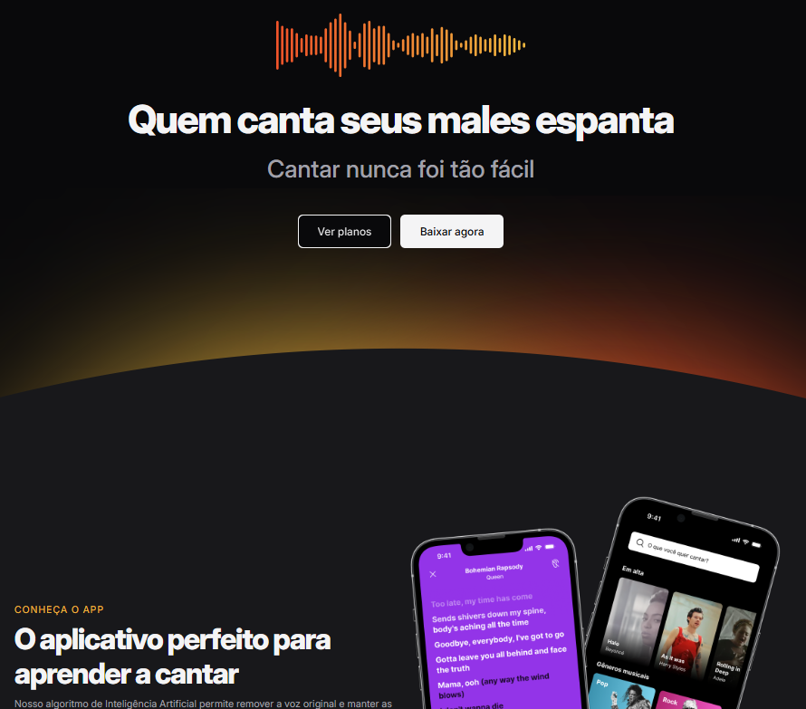

<h1 align="center"> 🎵 Zingen </h1>

Projeto desenvolvido para praticar e aprimorar conceitos de desenvolvimento web, inspirado pela arte de <strong>Zingen</strong> — “cantar” em holandês.  
A ideia nasceu da intenção de criar um espaço simples, fluido e intuitivo, onde música, funcionalidade e aprendizado caminham juntos.

  <a href="#-tecnologias">Tecnologias</a>&nbsp;&nbsp;&nbsp;|&nbsp;&nbsp;&nbsp;
  <a href="#-projeto">Projeto</a>&nbsp;&nbsp;&nbsp;|&nbsp;&nbsp;&nbsp;
  <a href="#-layout">Layout</a>

  

## 🚀 Tecnologias

Esse projeto foi desenvolvido com as seguintes tecnologias:

- HTML e CSS  
- Responsividade (Mobile First)
- Git e Github  
- Figma  

## 💻 Projeto

O **Zingen** é um projeto desenvolvido com foco em **interatividade e responsividade**, passando pelo conceito essencial de *mobile first*.  
A interface foi planejada inicialmente para telas menores, garantindo uma experiência fluida no mobile e, posteriormente, expandida para outras resoluções.

Ao longo do desenvolvimento, foram trabalhados elementos importantes como:

- navegação simples e intuitiva  
- menus interativos  
- troca de telas e seções  
- ajustes visuais para diferentes tamanhos de dispositivos  

Além de fortalecer conhecimentos fundamentais de **HTML e CSS**, o projeto reforça boas práticas de estruturação, semântica e organização de código — pilares importantes para qualquer desenvolvedora em formação.

## 🔖 Layout

Você pode visualizar o layout final do projeto através  
👉 **[DESSE LINK](https://renatamayra.github.io/zingen/)**

---

Feito com ♥ por Renata Mayra ✨ | Em constante evolução 🎶
